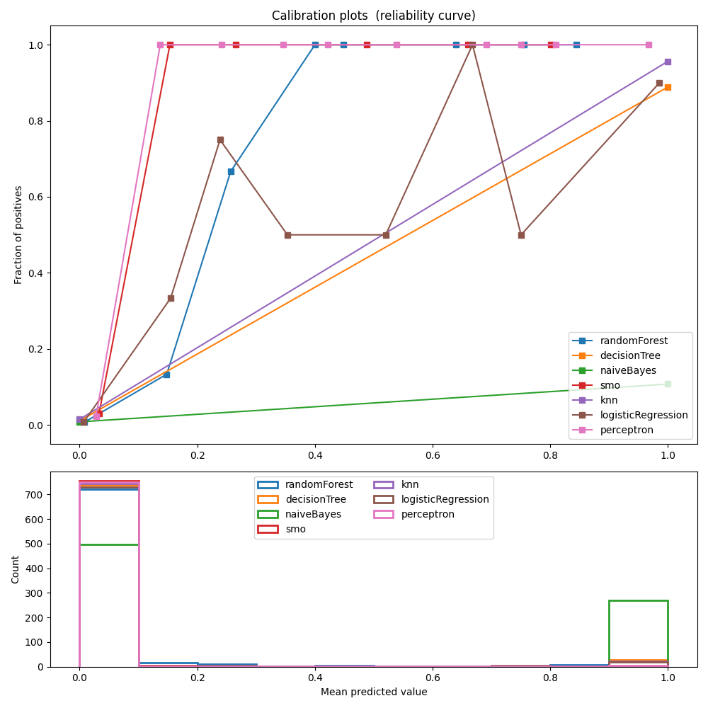
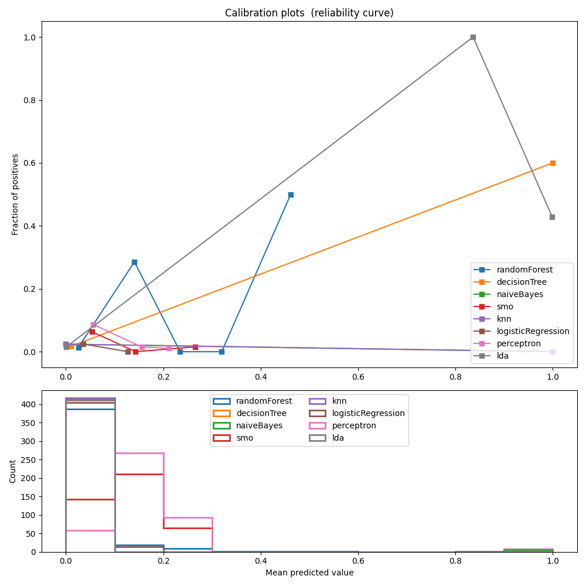

<h1 align="center">Vocabulary of flaky tests in Javascript</h1>
<p href="#descricao" align="center">XXII Brazilian Symposium on Software Quality (SBQS ’23), November 7–10, 2023, Brasília, Brazil</p>

# Vocabulary of Flaky Tests in Javascript

**Abstract**: 

*Context: Regression testing is a software verification and validation activity in modern software engineering. 
In this activity, tests can fail without any implementation change, characterizing a flaky test. 
Flaky tests may delay the release of the software and reduce testing confidence. 
One way to identify flaky tests is by re-running the tests, but this has a high computational cost. 
An alternative to re-execution is the static analysis of the code of the test cases, identifying patterns related to flaky tests. 
Objective: The objective of this work was to identify flaky tests in Javascript applications by analyzing the source code of the test cases, without executingthem. 
Method: A dataset was built with flaky test cases extracted from open source software hosted on GitHub and implemented in Javascript. 
Then, a classification model and a flakiness vocabulary were created, considering the source code of flaky tests in the Javascript language. Results: We observed good results during the execution of most classifiers using the training and validation sets, with the best result being the logistic regression algorithm. However, when classifying the test set, the performance was not good, with the best results being the linear discriminant analysis. We obtained a vocabulary related to instability with words associated with asynchronous behavior (then, await, return) and related to UI (layout, gd, plot, click). Conclusions: This work presents relevant results toward a more efficient identification of flaky tests in projects that use Javascript. Further studies are required to consolidate a reliable classification of tests regarding flakiness using
the vocabulary approach.*


# Bibtex

```
@InProceedings{Rafael.Soratto-GraciottoSilva:2023,
  title            = {Vocabulary of Flaky Tests in Javascript},
  author           = {Rafael Rampim Soratto and Marco Aurélio Graciotto Silva},
  doi              = {10.1145/3629479.3629487},
  booktitle        = {XXII Simpósio Brasileiro de Qualidade de Software},
  month            = nov,
  year             = {2023},
  location         = {Brasília, DF, Brazil},
  pages            = {1--10},
  publisher        = {ACM},
  address          = {New York, NY, USA}
}

```
# Table of contents

## Flaky Tests Tokenization Features

- [Get Tokens From Test Code into Github Repositories](#tokenizer)
- [Creating Dataset With JSON's](#dataset)
- [RQ1](#rq1)
- [RQ2](#rq2)

# Tokenizer

## Setup Repositories

```
cd configs
```

- Add repository author and name with format (author/name) on line into repositories.txt
  - Example: 
    ``` 
    angular/angular
    angular/components
    ```

- Add repositories tests paths and names on `availables-tests-folders.txt` and `availables-test-names.txt` 
  - Example:
    - `availables-tests-folders.txt`
    ``` 
    test
    spec
    __tests__
    tests
    integration
    e2e-tests
    integration-tests
    js/tests
    ```
    
    - `availables-test-names.txt`
    ``` 
    test
    it
    ```

## Run tokenizer

```
cd src/
yarn
yarn run:tokenizer
```

## Tokens result

- All tokens from repositories are saved into: `./datasets/tests/normal-tests.json`
- Every test code has ID and name
- We create new json with flaky selecteds from this file w all tokens from all tests:
  - `flaky-parsed-experiment-1.json`
  - `flaky-parsed-experiment-2.json`

- To run RQ1 and RQ2 we use `datasets/dataframes` path

# Dataset

*Creating csv files with json files*

> With tokenizer we can get a list of tokens from a list of tests. With json we can build dataset on csv format.

- The code are into `main` func into `src/flakydict.py`. Just replace with json and csv files names on main func.


# RQ1

## Install python requirements

```python
pip3 install requirements.txt
```

## Run

```
python3 RQ1/RQ1.1/exec.py 
```

## Results of First and Second Cenario


Same training and test datasets             |  Different name training and test datasets
:-------------------------:|:-------------------------:
  |  


# RQ2

## Run

```
python3 RQ2/information_gain.py 
```


## Javascript Flaky Vocabulary of first cenario
| TOP20  | position | token        | information_gain | total_ocurrences | total_flaky_occurrences | total_nonflaky_occurrences |
|---|----------|--------------|------------------|------------------|--------------------------|-----------------------------|
| 0 | 0        | then         | 0.032            | 56               | 41                      | 15                          |
| 1 | 1        | gd           | 0.024            | 27               | 27                      | 0                           |
| 2 | 2        | function     | 0.022            | 59               | 32                      | 27                          |
| 3 | 3        | cy           | 0.020            | 27               | 24                      | 3                           |
| 4 | 4        | done         | 0.019            | 77               | 36                      | 41                          |
| 5 | 5        | getByTestID  | 0.018            | 21               | 21                      | 0                           |
| 6 | 6        | click        | 0.018            | 70               | 31                      | 39                          |
| 7 | 7        | var          | 0.018            | 47               | 27                      | 20                          |
| 8 | 8        | it           | 0.017            | 19               | 19                      | 0                           |
| 9 | 9        | 0            | 0.016            | 264              | 44                      | 220                         |
|10 | 10       | 1            | 0.014            | 246              | 37                      | 209                         |
|11 | 11       | Plotly       | 0.014            | 16               | 16                      | 0                           |
|12 | 12       | layout       | 0.013            | 21               | 17                      | 4                           |
|13 | 13       | should       | 0.012            | 28               | 17                      | 11                          |
|14 | 14       | return       | 0.011            | 89               | 23                      | 66                          |
|15 | 15       | data         | 0.010            | 86               | 19                      | 67                          |
|16 | 16       | y            | 0.010            | 26               | 13                      | 13                          |
|17 | 17       | await        | 0.010            | 406              | 33                      | 373                         |
|18 | 18       | const        | 0.009            | 1053             | 46                      | 1007                        |
|19 | 19       | page         | 0.009            | 29               | 13                      | 16                          |
|20 | 20       | type         | 0.008            | 72               | 20                      | 52                          |


## Javascript Flaky Vocabulary of second cenario

| TOP 12 | position | token        | information_gain | total_ocurrences | total_flaky_occurrences | total_nonflaky_occurrences |
|---|----------|--------------|------------------|------------------|--------------------------|-----------------------------|
| 0 | 0        | obj          | 0.004            | 31               | 3                       | 28                          |
| 1 | 1        | P            | 0.004            | 3                | 3                       | 0                           |
| 2 | 2        | PACKET_EVENT | 0.004            | 3                | 3                       | 0                           |
| 3 | 3        | browser      | 0.004            | 518              | 5                       | 513                         |
| 4 | 4        | serializer    | 0.004            | 7                | 3                       | 4                           |
| 5 | 5        | await        | 0.004            | 906              | 5                       | 901                         |
| 6 | 6        | s            | 0.004            | 37               | 3                       | 34                          |
| 7 | 7        | now          | 0.003            | 8                | 3                       | 5                           |
| 8 | 8        | dev          | 0.003            | 2                | 2                       | 0                           |
| 9 | 9        | eval         | 0.003            | 148              | 3                       | 145                         |
|10 | 10       | expect       | 0.003            | 1622             | 8                       | 1614                        |
|11 | 11       | toBe         | 0.003            | 514              | 6                       | 508                         |
|12 | 12       | Math         | 0.003            | 4                | 2                       | 


# Authors

<table>
  <tr>
    <td align="center"><a href="https://www.linkedin.com/in/rafael-rampim-soratto-a42793190/"></a><br /><a href="https://www.linkedin.com/in/rafael-rampim-soratto-a42793190/" title="Rafael Soratto"></a></td>
  </tr>
</table>

